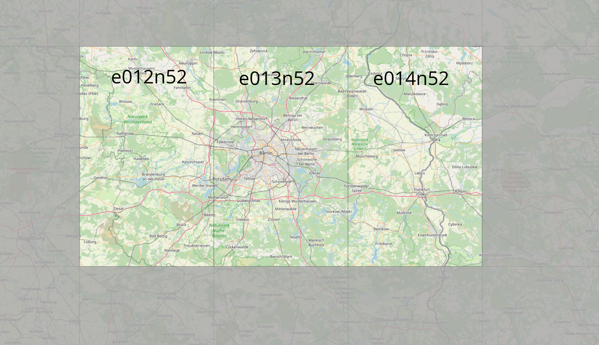

## Main custom scenery of Berlin, Germany for FlightGear Flight Simulator

### This package contains
* Berlin Brandenburg "Willy Brandt" Airport
	* Latest terrain/taxiways
	* Fully developed terminals + secondary buildings
	* SID/STAR/APP FMS procedures
	* (beta) AI carsystem for gound vehicles
* Berlin Tegel Airport (terrasync)
	* Main terminal and some shared objects
	* SID/STAR/APP FMS procedures
	* soon: more secondary buildings
* Berlin Tempelhof Airport (closed/terrasync)
	* fully modelled famous disused airfield
* All airports / heliports in covered area
* Important buildings/facilites in Berlin
* osm2city for all of Berlin
* Terrain update
* Navaid update

### carsystem installation (beta)

* copy the content from /Berlin/AI/BER_Carsystem into your $FG_ROOT/AI/ folder.
* Linux: sudo cp -r ...../Berlin/AI/BER_Carsystem/* /usr/share/games/flightgear/AI/

### Links
* **Forum thread**:  https://forum.flightgear.org/viewtopic.php?f=5&t=33879 
* **FlightGear Wiki**
	* BER: http://wiki.flightgear.org/Berlin_Brandenburg_Airport
	* TXL: http://wiki.flightgear.org/Berlin_Tegel_Airport
	* THF: http://wiki.flightgear.org/Berlin_Tempelhof_Airport

### Developers
* Ger272
* D-ECHO
* D-SVEN

### This Scenery project uses the following data:
* Landclass (shapefile) data comes from: 
	* Landuse and Landcover data from the Copernicus Project of the European Union (CORINE) 
	https://land.copernicus.eu/pan-european/corine-land-cover © European Union, Copernicus Land Monitoring Service 2018, European Environment Agency (EEA) 
	* Landuse and Landcover data from the OpenStreetMap project 
	(http://www.openstreetmap.org) available under the Open Database License (ODbL) 
	* Road, Railway and Waterway data from the OpenStreetMap project 
	(http://www.openstreetmap.org) available under the Open Database License (ODbL) 
* Elevation data from 
	http://viewfinderpanoramas.org/Coverage%20map%20viewfinderpanoramas_org3.htm 
* Airport data from 
	https://gateway.x-plane.com
* osm2city:
	https://gitlab.com/osm2city
* osm raw data:
	https://download.geofabrik.de/
* Objects from user Ger272 on the flightgear forum https://forum.flightgear.org  
	**Thanks!** (re-structured) and TerraSync (FlightGear Project)

### This project comes with absolutely no warranty!

**This scenery is available under GPL (GNU General Public License), version 2 or later**

**Thanks to the data providers and have fun with this scenery!**
